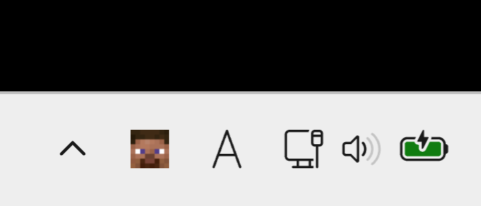

<div align="center">
  
  <h1>MineTray</h1>
</div>

Minecraft Java Edition サーバーの稼働状況をタスクトレイで監視する常駐型アプリです。
指定したサーバーのログイン状況に応じて、タスクトレイアイコンがログイン中のプレイヤーの顔アイコンに切り替わります。

## 主な機能

- **サーバー監視**: 指定した Minecraft サーバーへ定期的に Ping を送信し、オンライン人数とプレイヤーリストを取得
- **複数サーバー管理**: 複数のサーバーを登録し、監視対象を切り替え可能
- **タスクトレイ表示**:
  - プレイヤーのスキン（顔）を取得し、アイコンとしてローテーション表示
  - オンライン時は緑のアイコン、オフライン時は赤のアイコン
  - ツールチップでオンライン人数を表示
- **スマート通知**: プレイヤーの参加/退出を検出して通知（大規模サーバー対応）
- **プレイヤーリスト**: 左クリックでオンライン/オフラインのプレイヤー一覧を表示
- **日本語/英語対応**: メニューおよび UI の多言語対応

## スクリーンショット

タスクトレイに Minecraft プレイヤーのスキンがアニメーション表示されます。



## 必要環境

- Windows 10 / 11
- .NET 8.0 Runtime (自己完結型ビルドでは不要)

## インストール方法

### インストーラー (推奨)

1. [Releases](https://github.com/kihi78/MineTray/releases) から `MineTray_Setup_x.x.x.exe` をダウンロード
2. 実行して画面の指示に従いインストール
3. デスクトップのショートカットまたはスタートメニューから起動

### ポータブル版 (ZIP)

1. [Releases](https://github.com/kihi78/MineTray/releases) から `MineTray_v1.0.0.zip` をダウンロード
2. 任意のフォルダに展開
3. `MineTray.exe` を実行

> **Note**: いずれも自己完結型のため、.NET Runtime のインストールは不要です。

### ソースコードから実行

```powershell
git clone https://github.com/kihi78/MineTray.git
cd MineTray
dotnet run --project MineTray/MineTray.csproj
```

### リリースビルド

```powershell
# ビルドスクリプトを使用
./build.ps1 -Publish -CreateZip

# または手動で
dotnet publish MineTray/MineTray.csproj -c Release -r win-x64 --self-contained true -p:PublishSingleFile=true -o publish
```

## 使い方

1. アプリを起動するとタスクトレイにアイコンが表示されます
2. 右クリック → 設定 → サーバー設定 で監視したいサーバーを追加
3. サーバーアドレスと表示名を入力し、「監視対象に設定」をクリック
4. 左クリックでプレイヤーリストを表示
5. プレイヤーが参加/退出すると通知が表示されます

## プロジェクト構成

```
MineTray/
├── MineTray/                    # メインプロジェクト
│   ├── Models/                  # データモデル
│   │   ├── AppSettings.cs       # アプリケーション設定
│   │   ├── ServerConfig.cs      # サーバー設定
│   │   ├── MinecraftServerStatus.cs  # サーバーステータス
│   │   └── ...
│   ├── Services/                # サービス層
│   │   ├── MinecraftServerPinger.cs  # サーバー通信 (SLP)
│   │   ├── SkinManager.cs       # スキン取得・キャッシュ
│   │   ├── IconService.cs       # アイコン管理
│   │   ├── NotificationService.cs # 通知サービス
│   │   └── PlayerHistoryManager.cs  # プレイヤー履歴
│   ├── Forms/                   # UI
│   │   ├── SettingsForm.cs      # 設定画面
│   │   ├── PlayerListForm.cs    # プレイヤーリスト
│   │   └── LayoutConstants.cs   # レイアウト定数
│   ├── Assets/                  # アイコン画像
│   ├── MineTrayApplicationContext.cs  # メインロジック
│   └── Program.cs               # エントリーポイント
├── MineTray.Tests/              # ユニットテスト (xUnit)
│   ├── AppSettingsTests.cs
│   ├── MinecraftTextCleanerTests.cs
│   └── ...
└── MineTray.sln                 # ソリューションファイル
```

## 免責事項・プライバシーポリシー

### 免責事項

本ソフトウェアは MIT License の下で提供されるオープンソースソフトウェアです。
ユーザーは、本ソフトウェアを自己の責任において使用するものとします。開発者は、本ソフトウェアの使用または使用不能から生じるいかなる損害（PC の不具合、サーバー上のトラブルなどを含むがこれに限らない）について、一切の責任を負いません。

### プライバシーポリシー

**1. 個人情報の収集について**
MineTray（以下、本アプリ）は、ユーザーの個人情報を収集・送信することはありません。
また、ユーザーの操作ログやデバイス情報を追跡（トラッキング）する機能は実装していません。

**2. 外部サービスとの通信**
本アプリは、機能を実現するために最小限の範囲で以下の外部サービスと通信を行います。

- **Minecraft サーバー (ユーザーが指定した IP)**
  - **送信内容**: Server List Ping (SLP) プロトコルに基づくステータス確認リクエスト
  - **目的**: サーバーの稼働状況・人数・プレイヤーリストを表示するため
- **Minotar / Mojang API** ([https://minotar.net](https://minotar.net))
  - **送信内容**: プレイヤーの UUID
  - **目的**: プレイヤーのスキン画像（顔アイコン）を表示するため

**3. データのローカル保存**
本アプリは、以下のデータをユーザーの PC 内（アプリケーションと同じフォルダ）にのみ保存します。これらのデータが開発者のサーバー等へ無断で送信されることはありません。

- `settings.json`: ユーザーの設定（監視サーバーリスト、通知設定など）
- `players.json`: 過去にログインしたプレイヤーの履歴キャッシュ

## ライセンス

MIT License

本ソフトウェアは [MIT License](LICENSE) の下で公開されています。
詳細は LICENSE ファイルをご確認ください。

Copyright (c) 2025 kihi78

## 技術仕様

- **.NET 8.0 WinForms**
- **Minecraft SLP (Server List Ping)** プロトコル
- **Minotar API** でプレイヤースキン取得
- **DnsClient** ライブラリで SRV レコード解決
